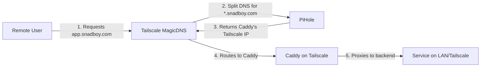
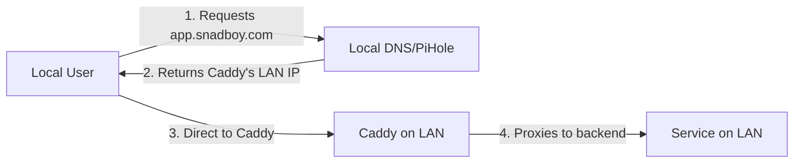
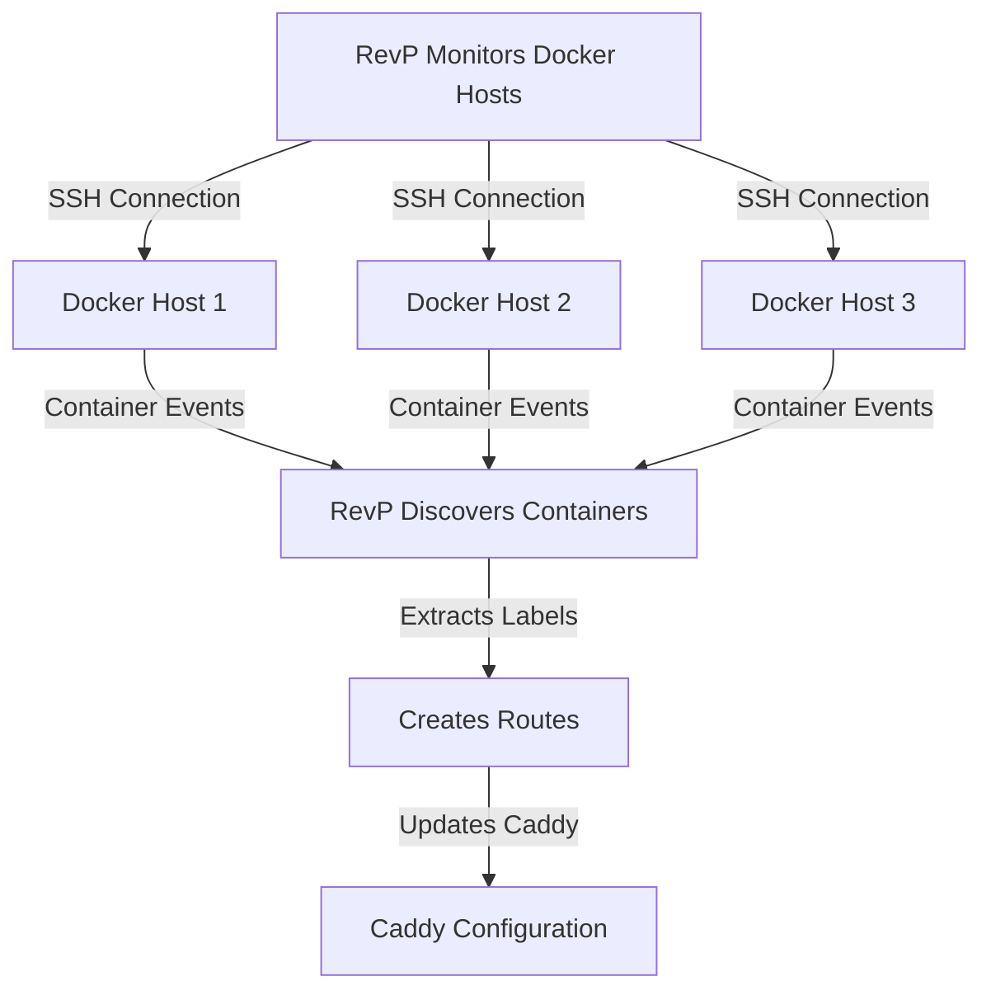

# Unified DNS and Reverse Proxy Architecture with Tailscale, PiHole, and RevP

## Overview

This architecture creates a unified, secure access layer for all services in a homelab environment. It combines Tailscale's secure networking, PiHole's DNS management, and RevP/Caddy's reverse proxy capabilities to provide seamless access to services whether you're on the LAN or connecting remotely.

## Architecture Components

### 1. **Tailscale** - Secure Network Mesh
- Provides encrypted peer-to-peer connections
- MagicDNS automatically assigns hostnames to all Tailscale nodes
- Split DNS capability forwards specific domains to custom DNS servers

### 2. **PiHole** - Authoritative DNS for snadboy.com
- Acts as the single source of truth for all `*.snadboy.com` DNS entries
- Manages both public service names and internal management hostnames
- Accessible through Tailscale's split DNS configuration

### 3. **RevP (Docker Reverse Proxy)** - Container Discovery and Route Management
- Automatically discovers Docker containers with specific labels
- Manages static routes for non-Docker services
- Dynamically configures Caddy with discovered routes

### 4. **Caddy** - Reverse Proxy and SSL Termination
- Single entry point for all services
- Handles SSL certificates automatically
- Bridges between Tailscale network and LAN services

## DNS Resolution Flow

### Remote User Access Path



**Detailed Steps:**
1. Remote user connected to Tailscale requests `app.snadboy.com`
2. Tailscale MagicDNS recognizes `snadboy.com` is configured for split DNS
3. Query forwarded to PiHole (e.g., `100.x.x.x` on Tailscale network)
4. PiHole resolves `app.snadboy.com` → Caddy's Tailscale IP (e.g., `100.99.5.9`)
5. Request reaches Caddy on its Tailscale interface
6. Caddy matches the domain to a configured route
7. Caddy forwards request to backend service (LAN IP or Tailscale hostname)
8. Response returns through the same path

### Local User Access Path



## RevP Operation

### Container Discovery Process



**How RevP Discovers Services:**

1. **SSH Connections**: RevP connects to configured Docker hosts via SSH
   ```yaml
   hosts:
     switchboard:
       hostname: vm-switchboard.snadboy.com  # Resolves to LAN IP via PiHole
     media-arr:
       hostname: vm-media-arr.snadboy.com
     fabric:
       hostname: vm-fabric.snadboy.com
   ```

2. **Container Label Detection**: RevP looks for specific labels
   ```yaml
   labels:
     - "snadboy.revp.80.domain=myapp.snadboy.com"
     - "snadboy.revp.80.backend-proto=http"
     - "snadboy.revp.80.force-ssl=true"
   ```

3. **Dynamic Route Creation**: RevP creates Caddy routes
   - Domain: `myapp.snadboy.com`
   - Backend: `http://{container_host_ip}:{published_port}`

### Static Routes for Non-Docker Services

```yaml
# static-routes.yml
routes:
  - domain: proxmox.snadboy.com
    backend_url: https://proxmox:8006      # Uses Tailscale MagicDNS
    force_ssl: true
    tls_insecure_skip_verify: true
    
  - domain: nas.snadboy.com  
    backend_url: http://192.168.1.100:5000 # Direct LAN IP
    force_ssl: true
    
  - domain: service.snadboy.com
    backend_url: http://remote-server:8080 # Another Tailscale node
    support_websocket: true
```

## Backend Resolution Strategies

### 1. **LAN IP Addresses**
```yaml
backend_url: http://192.168.1.50:8080
```
- Direct connection to LAN services
- No DNS resolution needed
- Fastest for local services

### 2. **Tailscale MagicDNS Names**
```yaml
backend_url: http://colossus:8006
```
- Resolves to Tailscale IP (100.x.x.x)
- Automatic failover if host reconnects
- Works across different networks

### 3. **Hybrid DNS Names**
```yaml
backend_url: http://vm-service.snadboy.com:9000
```
- Resolves through split DNS → PiHole
- Can point to either LAN or Tailscale IPs
- Most flexible approach

## DNS Configuration

### PiHole Configuration

```dns
# Wildcard for all services - points to Caddy
*.snadboy.com    IN A    100.99.5.9  # Caddy's Tailscale IP

# Specific entries for management/SSH access
vm-switchboard.snadboy.com    IN A    192.168.1.10
vm-media-arr.snadboy.com      IN A    192.168.1.11
vm-fabric.snadboy.com         IN A    192.168.1.12
```

### Tailscale Split DNS Configuration

```
# Configure in Tailscale admin panel
Split DNS for snadboy.com → 100.x.x.x (PiHole's Tailscale IP)
```

## Security Benefits

1. **Zero Trust Access**
   - All remote access requires Tailscale authentication
   - No ports exposed to the internet
   - End-to-end encryption via WireGuard

2. **Service Isolation**
   - Services remain on private LAN
   - Only Caddy has Tailscale access
   - Centralized access control

3. **Flexible Security Policies**
   - Can restrict certain services to LAN only
   - Easy to add/remove Tailscale access per service
   - Audit trail through Caddy logs

## Advanced Use Cases

### Multi-Site Services
```yaml
# Service running on different physical location
- domain: remote-app.snadboy.com
  backend_url: http://remote-node:8080  # Tailscale node in another location
```

### Load Balancing
```yaml
# Multiple backends for one service
- domain: api.snadboy.com
  backend_url: http://api-1:8000
- domain: api.snadboy.com  
  backend_url: http://api-2:8000
```

### Development vs Production
```yaml
# Easy switching between environments
- domain: dev.snadboy.com
  backend_url: http://localhost:3000    # Local development
  
- domain: prod.snadboy.com
  backend_url: http://prod-server:3000  # Production on Tailscale
```

## Troubleshooting Guide

### DNS Resolution Issues
1. **Check Tailscale MagicDNS**: `tailscale status`
2. **Verify Split DNS**: `nslookup app.snadboy.com 100.x.x.x`
3. **Test from container**: `docker exec revp nslookup app.snadboy.com`

### RevP Connection Issues
1. **Verify SSH access**: `ssh revp@vm-host.snadboy.com`
2. **Check container logs**: `docker logs docker-revp`
3. **Validate hosts.yml**: Ensure hostnames resolve correctly

### Caddy Route Issues
1. **Check active routes**: `curl http://caddy:2019/config/apps/http/servers`
2. **Verify backend connectivity**: `curl -v http://backend:port`
3. **Review Caddy logs**: `docker logs caddy`

## Best Practices

1. **Use Descriptive Hostnames**
   - Tailscale: `media-server`, `backup-nas`
   - Services: `plex.snadboy.com`, `nextcloud.snadboy.com`

2. **Document Your Routes**
   - Comment static routes with purpose and owner
   - Keep a network diagram updated

3. **Monitor Health**
   - Set up health checks for critical services
   - Monitor Caddy metrics
   - Track DNS query patterns in PiHole

4. **Plan for Growth**
   - Use consistent naming conventions
   - Group related services (media.*, dev.*, etc.)
   - Consider subdomains for different environments

## Conclusion

This architecture provides a robust, secure, and flexible way to expose services both locally and remotely. By leveraging Tailscale's secure networking, PiHole's DNS management, and RevP/Caddy's dynamic routing capabilities, you get:

- **Single DNS namespace** for all services
- **Automatic SSL certificates** via Caddy
- **Secure remote access** without VPN complexity
- **Dynamic service discovery** for Docker containers
- **Flexible routing** between Tailscale and LAN networks

The beauty of this system is its simplicity from the user perspective - they just access `service.snadboy.com` and everything else happens automatically behind the scenes.